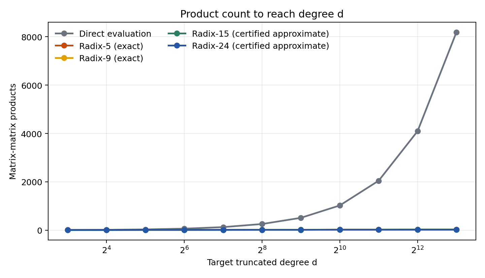

# neumann-kernels

`neumann-kernels` is a small Python library for low-product radix kernels for
truncated Neumann series, matrix inverse refinement, and certified contraction
analysis.

The core object is a radix-$r$ kernel that approximates

$$
S_d(B) = I + B + B^2 + \cdots + B^{d-1},
$$

while using far fewer matrix-matrix products than direct polynomial evaluation.
For inverse refinement, the kernels are intended to be used inside residual
iterations of the form

$$
Y_{k+1} = Y_k T_r(R_k),
\qquad
R_k = I - A Y_k.
$$

This repository is meant to be useful on its own:

- it exposes exact radix-5 and radix-9 kernels,
- it ships certified radix-15 and radix-24 kernel data,
- it provides cost-model helpers for choosing a radix at a target degree,
- and it includes beginner-oriented notebooks that explain the formulas and
  tradeoffs from first principles.

The companion paper is included only as a reference for proofs and derivations,
not as the reason the repository exists.

## Documentation Site

- Homepage: <https://piyush314.github.io/neumanOpt/>
- First steps tutorial: <https://piyush314.github.io/neumanOpt/tutorials/first-steps>
- Certified kernels tutorial: <https://piyush314.github.io/neumanOpt/tutorials/certified-kernels>
- Cost model tutorial: <https://piyush314.github.io/neumanOpt/tutorials/cost-model-and-benefit-plot>
- Paper page: <https://piyush314.github.io/neumanOpt/paper>
- Colab first steps: <https://colab.research.google.com/github/piyush314/neumanOpt/blob/main/docs/tutorials/01_first_steps.ipynb>
- Colab certified kernels: <https://colab.research.google.com/github/piyush314/neumanOpt/blob/main/docs/tutorials/02_certified_kernels.ipynb>
- Colab cost model walkthrough: <https://colab.research.google.com/github/piyush314/neumanOpt/blob/main/docs/tutorials/03_cost_model_and_benefit_plot.ipynb>

## Why use this library?

Use `neumann-kernels` when you need one of these:

- fast evaluation of long truncated Neumann polynomials,
- explicit low-product kernels instead of generic Paterson-Stockmeyer style
  evaluation,
- certified higher-radix contraction data for approximate kernels,
- or a lightweight reference implementation of the kernel cost model.

For a target degree `d`, a kernel with radix `r` and kernel-product count `mu`
needs only

$$
C(r,\mu,d) = (\mu + 2)\,\lceil \log_r d \rceil
$$

matrix-matrix products in the standard residual update model. The `+2` term is
the update overhead per outer step.

## Benefit At A Glance

The plot below compares the matrix-product count needed to reach a target degree
`d` using direct evaluation versus the kernels shipped here.



## Kernel Catalog

| Method | Radix | Kernel products `mu` | Full-step products `mu + 2` | `(mu + 2)/log2(radix)` | Status |
|---|---:|---:|---:|---:|---|
| Direct polynomial evaluation | - | - | `d - 1` | linear in `d` | exact baseline |
| Radix-5 | 5 | 2 | 4 | 1.723 | exact |
| Radix-9 | 9 | 3 | 5 | 1.577 | exact |
| Radix-15 | 15 | 4 | 6 | 1.536 | certified approximate |
| Radix-24 | 24 | 5 | 7 | 1.527 | certified approximate |

The library exposes this same catalog programmatically via
`neumann_kernels.kernel_catalog()`.

## Installation

Minimal install:

```bash
python -m venv .venv
. .venv/bin/activate
pip install -e .
```

For plotting and notebooks:

```bash
pip install -e '.[plots,tutorials]'
```

## Quick Start

```python
from neumann_kernels import kernel_catalog, load_certified_kernel, multiply_count

for row in kernel_catalog():
    print(
        row["display_name"],
        row["status"],
        round(row["asymptotic_coefficient"], 3),
    )

rad24 = load_certified_kernel("radix24")
print(rad24["safe_radii"])

print(multiply_count(24, 5, 4096))
```

Expected takeaways:

- `kernel_catalog()` gives the exact and certified approximate options,
- `load_certified_kernel("radix24")` loads the shipped certificate metadata,
- `multiply_count(24, 5, 4096)` returns `21`, which is far below the `4095`
  products needed by direct evaluation of a degree-4096 polynomial.

## Tutorials

Start with the tutorials in the
[documentation site](https://piyush314.github.io/neumanOpt/):

- [`First steps`](https://piyush314.github.io/neumanOpt/tutorials/first-steps) or [open in Colab](https://colab.research.google.com/github/piyush314/neumanOpt/blob/main/docs/tutorials/01_first_steps.ipynb): what truncated Neumann kernels are, why radix matters, and how to choose a first kernel.
- [`Certified kernels`](https://piyush314.github.io/neumanOpt/tutorials/certified-kernels) or [open in Colab](https://colab.research.google.com/github/piyush314/neumanOpt/blob/main/docs/tutorials/02_certified_kernels.ipynb): how to load the shipped radix-15 and radix-24 certificates and interpret the safe radii.
- [`Cost model and benefit plot`](https://piyush314.github.io/neumanOpt/tutorials/cost-model-and-benefit-plot) or [open in Colab](https://colab.research.google.com/github/piyush314/neumanOpt/blob/main/docs/tutorials/03_cost_model_and_benefit_plot.ipynb): how the logarithmic cost model is built up and how to reproduce the README benefit plot.

## Repository Layout

- `src/neumann_kernels/`: the installable Python library.
- `data/certified/`: machine-readable certified kernel JSON files.
- `data/results/`: summary CSV and manifest files.
- `scripts/`: small standalone utilities, including the README plot generator.
- `docs/`: the GitHub Pages site, including the canonical tutorial notebooks.
- `paper/arxiv.pdf`: a copy of the companion paper PDF.

## Companion Paper

For proofs, the full kernel derivations, and the certification arguments, see
[`paper/arxiv.pdf`](paper/arxiv.pdf).

## Where To Start

If you are new to the library, begin with
the [documentation homepage](https://piyush314.github.io/neumanOpt/) or the
[first steps tutorial](https://piyush314.github.io/neumanOpt/tutorials/first-steps), then use
`kernel_catalog()` to choose a radix and `load_certified_kernel()` when you need
the shipped higher-radix certificates.
